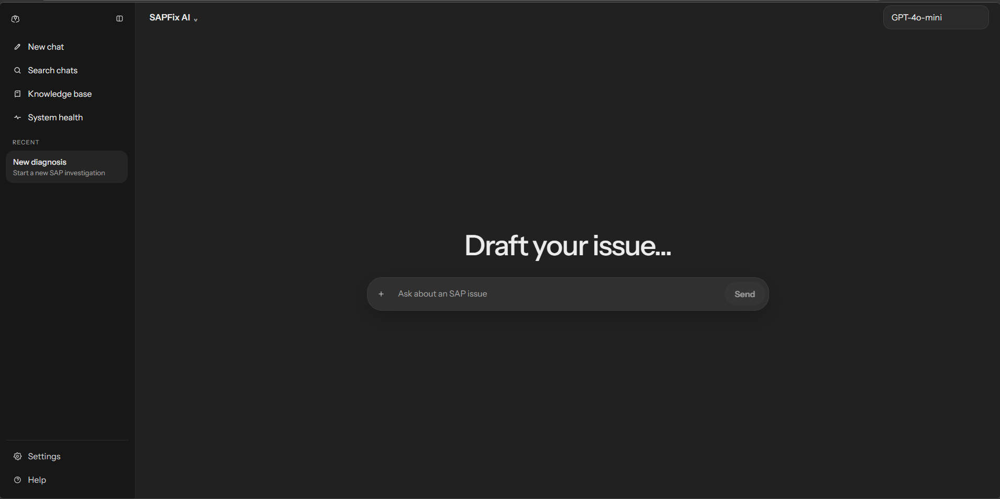
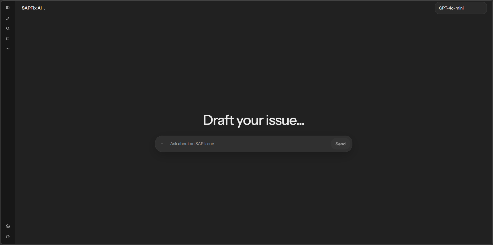
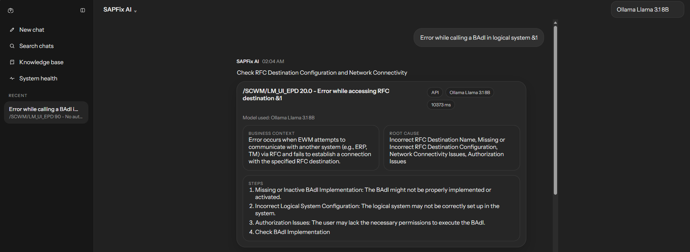
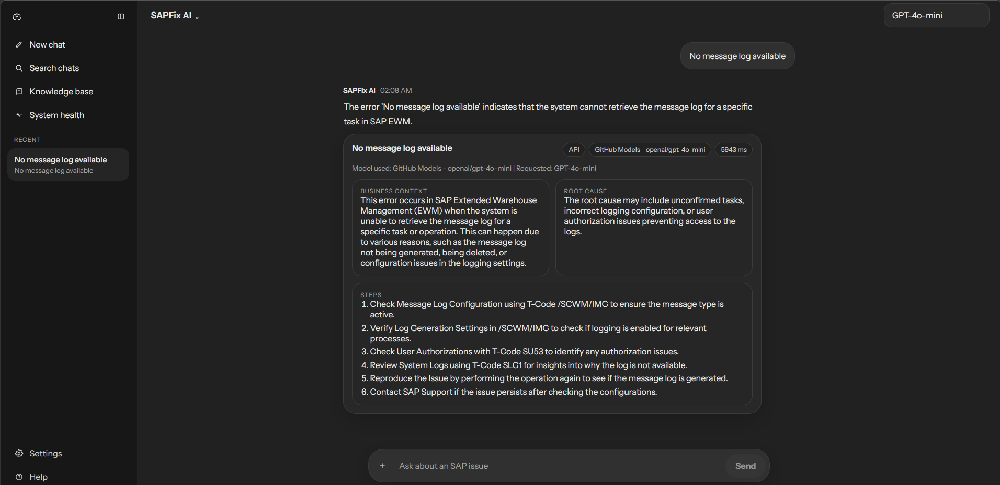
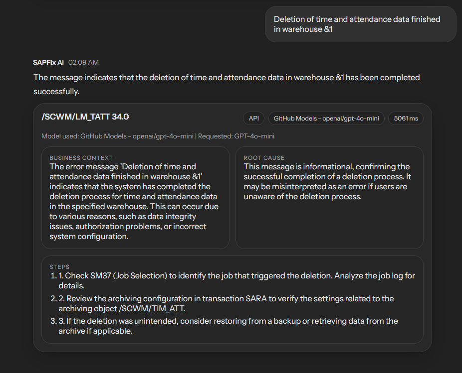
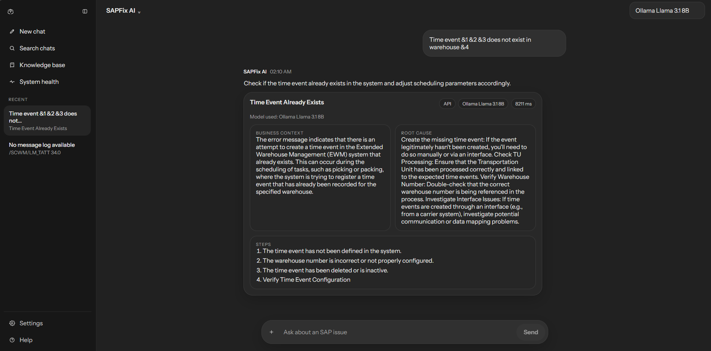
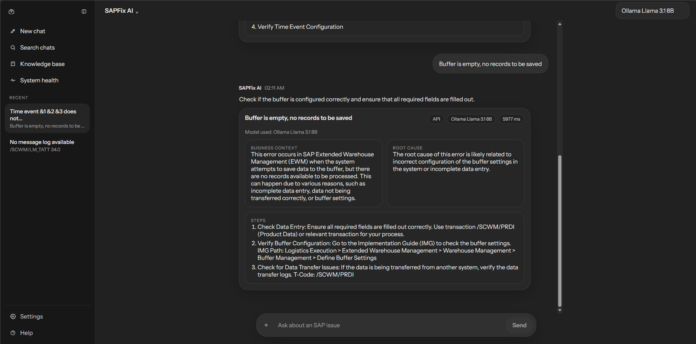
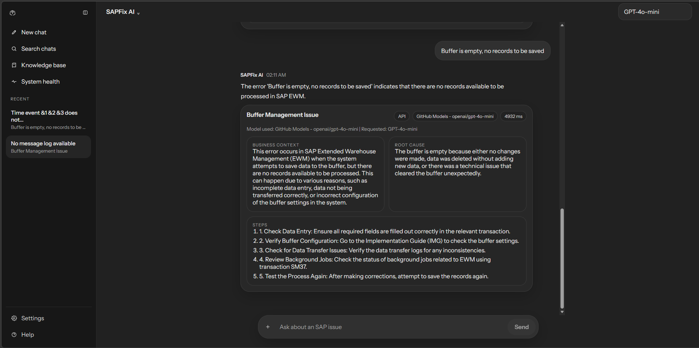

# SAPFix AI

SAPFix AI is a chat-style SAP troubleshooting app with a Python backend and a React frontend. It accepts SAP error text, retrieves the closest knowledge-base matches, and generates a guided response using either a hosted GPT model or a locally installed LLM.

## Versions In Use

- App version: `0.1.0`
- Frontend package version: `0.1.0`
- Hosted GPT model: `openai/gpt-4o-mini` via GitHub Models
- Local LLM model: `llama3.1:8b` via Ollama

## Model Setup

This project supports two generation paths:

1. Hosted model
   Uses GitHub Models through the OpenAI-compatible API.
   Model currently configured: `openai/gpt-4o-mini`

2. Local model
   Uses Ollama running on your machine.
   Model currently configured: `llama3.1:8b`

Only one external credential is required for the hosted path:

- `GITHUB_TOKEN`

The local Ollama path does not need an API key. It only requires Ollama to be installed locally and the model to be pulled and running.

Fallback behavior:

1. `GITHUB_TOKEN` with `https://models.github.ai/inference`
2. `OPENAI_API_KEY` as an optional fallback path
3. Local knowledge-base synthesis if generation is unavailable

## Tech Stack

### Frontend

- React `18.3.1`
- React DOM `18.3.1`
- TypeScript `5.6.3`
- Vite `5.4.11`

### Backend

- FastAPI `0.115.6`
- Uvicorn `0.34.0`
- OpenAI SDK `1.68.2`
- Requests `2.32.3`
- Python Dotenv `1.0.1`

### Data and Retrieval

- Pandas `2.2.2`
- OpenPyXL `3.1.5`
- ChromaDB `0.5.5`
- Sentence Transformers `3.0.1`
- Transformers `4.44.0`
- PyTorch `2.3.1+cu121`

Note:
The current API flow uses an offline-safe keyword retrieval path from the processed SAP knowledge-base JSON. Legacy embedding and vector-store code is still present in the repository for future retrieval upgrades.

## Current Architecture

- `api_server.py`
  FastAPI entrypoint exposing `/health`, `/models`, and `/chat`
- `src/chat_service.py`
  Retrieval, provider selection, prompt building, and final response shaping
- `frontend/`
  React + Vite UI with chat layout, model selector, and sidebar
- `data/`
  Local SAP knowledge-base inputs and processed artifacts
- `output/`
  Generated runtime outputs such as local vector database files
- `app.py`
  Older Streamlit prototype

## Environment

Create `.env` from `.env.example` and set the values you want to use:

```env
GITHUB_TOKEN=
GITHUB_MODELS_ENDPOINT=https://models.github.ai/inference
GITHUB_MODEL=openai/gpt-4o-mini
OPENAI_API_KEY=
OLLAMA_BASE_URL=http://localhost:11434/api/generate
```

Recommended setup:

- Use `GITHUB_TOKEN` for the hosted GPT path
- Keep `GITHUB_MODEL=openai/gpt-4o-mini`
- Install Ollama locally if you want the offline local model option
- Keep `OLLAMA_BASE_URL` pointed at your local Ollama server

Notes:

- `OPENAI_API_KEY` is optional in this repo and acts only as a fallback path
- If a GitHub token was pasted into `OPENAI_API_KEY`, the backend can still recognize it, but `GITHUB_TOKEN` is the cleaner setup
- The frontend reads its backend target from `frontend/.env.local` or `frontend/.env`

## Run The Backend

```bash
.venv\Scripts\python.exe -m uvicorn api_server:app --host 127.0.0.1 --port 8001
```

Available endpoints:

- `GET /health`
- `GET /models`
- `POST /chat`

Example request:

```json
{
  "query": "Enter the numbers without any gaps",
  "model": "gpt-4o-mini",
  "top_k": 3,
  "history": [
    { "role": "user", "text": "Enter the numbers without any gaps" }
  ]
}
```

The response includes:

- requested model
- actual generation model used
- provider label
- fallback note when GPT or Ollama could not be used

## Run The Frontend

```bash
cd frontend
npm install
npm run build
npm run dev
```

Set the frontend API target in `frontend/.env.local` or `frontend/.env`:

```env
VITE_API_BASE_URL=http://127.0.0.1:8001
```

## Local Ollama Setup

If you want to use the local model path:

```bash
ollama serve
ollama pull llama3.1:8b
```

Then choose `llama3.1:8b` from the frontend model selector.

## Data Privacy

The repository is configured so confidential SAP files do not get pushed accidentally.

Ignored local data includes:

- raw Excel SAP error files
- processed CSV and JSON exports
- embedding output files
- local runtime output folders

Only placeholder `.gitkeep` files inside `data/` and `output/` are tracked.

## Current Behavior

- The frontend shows both the requested model and the actual model/provider used
- GitHub Models is the primary hosted GPT path
- Ollama is the primary local offline path
- If a generation provider is unavailable, the backend still returns a grounded answer using the local SAP knowledge base
- The current retrieval path is keyword-based for reliability in local development

## Screenshots

These screenshots are stored in [`docs/screenshots`](docs/screenshots) so they can be pushed to GitHub and referenced directly from this README.

### Demo 01



### Demo 02



### Demo 03



### Demo 04



### Demo 05



### Demo 06



### Demo 07



### Demo 08


